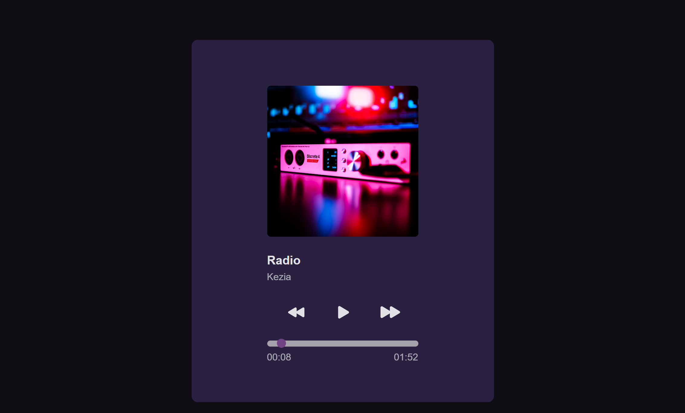
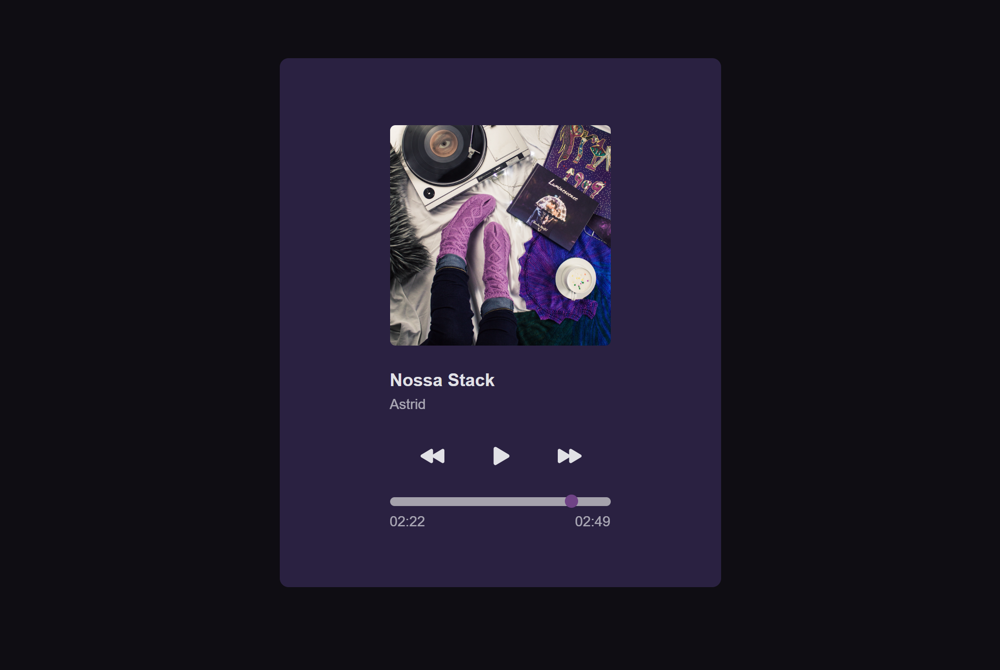

<h1 align="center"> Player de Música </h1>

Além do layout e desafio do #boraCodar01 da Rocketseat, adaptei para simular um player com JS. Arquivos de áudio baixados da biblioteca do YouTube com constroles criados em JavaScript  

  

  

#boraCodar são desafios semanais, promovido pela Rocketseat para ensino de tecnologias WEB.  

 

## 🚀 Tecnologias

Esse projeto foi desenvolvido com as seguintes tecnologias:

- HTML e CSS
- Git e Github
- Figma
- JavaScript

## 🔖 Layout

Você pode visualizar o layout do projeto através [DESSE LINK](https://www.figma.com/community/file/1195050524500542670). É necessário ter conta no [Figma](https://figma.com) para acessá-lo.

